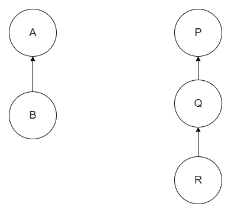
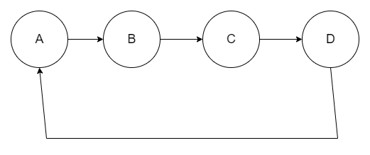

# Homework 3 Report - Jason Pereira (676827009)

## Index
- [Commands](#commands)
- [Expressions](#expressions)
- [Helper Classes](#helper-classes)
- [AccessModifiers](#accessmodifiers)
- [Examples on using the language](#examples-on-using-my-language)
- [Using Classes](#using-classes)
- [Using Abstract Classes and Interfaces](#using-abstract-classes-and-interfaces)
- [Installing and Running](#installing-and-running)
- [Implementation Details](#implementation-details)
- [Assignment Questions](#assignment-questions)
- [Limitations of the implementation](#limitations-of-the-implementation)
- [`Evaluator`](#evaluator)

## Constructs defined
I define the following constructs for my language. They are divided
into commands and expressions.

### Commands
A command represents an operating that you can perform in my language.
The following is the list of commands defined.


### `dsl.Assign(ident: String, exp: dsl.Expression)`
Evaluates expression `exp` and assigns it to a new variable named
`ident`.

### `dsl.Insert(setName: String, exps: dsl.Expression*)`
Assuming that a set named `setName` has been created,
`dsl.Insert()` will evaluate the expressions in its arguments to values
and insert them into set `setName`.

### `dsl.Delete(setName: String, exps: dsl.Expression*)`
Assuming that a set named `setName` has been created,
`dsl.Delete()` will evaluate the expressions in its arguments to values
and delete them from set `setName`.

### `dsl.CreateNewSet(name: String)`
Creates a new set called `name`.

### `dsl.Scope(name: String, commands: dsl.Command*)`
Creates a new scope with name `name`. Takes a variable number of commands
as its subsequent arguments and executes them within the newly
created scope. You can also create a scope within a scope.


### `dsl.DefineMacro(name: String, expression: dsl.Expression)`
Defines a macro named `name` for later use. A macro is an alias for an expression.
We can use this alias within another expression later for
further computation.


### `dsl.Display(message: String, identifier: String)`
Prints out a custom message followed by the contents of the variable
specified by `identifier`.

### `dsl.DefineClass(className: String, options: ClassDefinitionOption *`
Defines a class named `className`. Specify the properties of the class using options. Refer `ClassDefinitionOption` below and class examples.
Refer to the Using Classes section.

### `dsl.DefineInterface(intrefaceName: String, options: InterfaceDefinitionOption *`
Defines an interface named `intrefaceName`. Specify the properties of the class using options. Refer `InterfaceDefinitionOption` below and examples.
Refer to the Using Classes section.

### `dsl.NestedClass(className: String, options: ClassDefinitionOption *`
Defines a nested class named `className`. Specify the properties of the class using options. Refer `ClassDefinitionOption` below and class examples.
Refer to the Using Classes section.

### `dsl.InvokeMethod(returnee: Variable, objectName: String, methodName: String, params: Parameters*)`
Invokes a method on an object. `returnee` is the name of the variable you want to store the return value in. To ignore the return value, pass in `_`.

### `dsl.Return(exp: Expression)`
Returns a value from a method. Can only be used inside a method.

### `dsl.Print(message: Any)`
Used to print to the console.

### Expressions
A value is a single instance of any primitive type or Object.
Examples of values are: 3, 5, 4.56, "hello", new Object(), etc.

An expression eventually evaluates to a value. An expression can consist of
nested expressions.
```
dsl.Union(exp1: dsl.Expression, exp2: dsl.Expression)
dsl.Difference(exp1: dsl.Expression, exp2: dsl.Expression)
dsl.Intersection(exp1: dsl.Expression, exp2: dsl.Expression)
dsl.SymmetricDifference(exp1: dsl.Expression, exp2: dsl.Expression)
dsl.CartesianProduct(exp1: dsl.Expression, exp2: dsl.Expression)
dsl.CheckIfContains(exp1: dsl.Expression, exp2: dsl.Expression)
dsl.Value(value: Any)
dsl.Variable(name: String)
```

### `dsl.Union(exp1: dsl.Expression, exp2: dsl.Expression)`
Assuming that both exp1 and exp2 evaluate to sets,`dsl.Union(exp1: dsl.Expression, exp2: dsl.Expression)`
evaluates to the union of those sets.

### `dsl.Difference(exp1: dsl.Expression, exp2: dsl.Expression)`
Assuming that both exp1 and exp2 evaluate to sets,
`dsl.Difference(exp1: dsl.Expression, exp2: dsl.Expression)`
evaluates to the difference of those sets.

### `dsl.Intersection(exp1: dsl.Expression, exp2: dsl.Expression)`
Assuming that both exp1 and exp2 evaluate to sets,
`dsl.Intersection(exp1: dsl.Expression, exp2: dsl.Expression)`
evaluates to the intersection of those sets.

### `dsl.SymmetricDifference(exp1: dsl.Expression, exp2: dsl.Expression)`
Assuming that both exp1 and exp2 evaluate to sets,
`dsl.SymmetricDifference(exp1: dsl.Expression, exp2: dsl.Expression)`
evaluates to the symmetric difference of those sets.

### `dsl.CartesianProduct(exp1: dsl.Expression, exp2: dsl.Expression)`
Assuming that both exp1 and exp2 evaluate to sets,
`dsl.CartesianProduct(exp1: dsl.Expression, exp2: dsl.Expression)`
evaluates to the cartesian product of those sets.

### `dsl.CheckIfContains(exp1: dsl.Expression, exp2: dsl.Expression)`
Assuming that exp1 evaluates to a set,
`dsl.CheckIfContains(exp1: dsl.Expression, exp2: dsl.Expression)`
returns `true` if the set that `exp1` contains the
value that `exp2` evaluates to. Else it returns `false`

### `dsl.Value(value: Any)`
Represent a value (literal). Can be any type - including object, string,
int, float.

### `dsl.Variable(name: String)`
Represents the value stored in variable **name**. Can be any type - including object, string,
int, float.
If **name** has not been defined previously, then using this construct
will throw an error during execution.

### `dsl.This(fieldName: String)`
This construct is used to access an instance variable of an object inside a method.
Similar to:
```java
this.x
```
`This()` must be used everytime you want to set or get the value of an instance variable.
Refer the **Classes** section and the test cases for usage.

### `dsl.This(fieldName: String, outerClassName: String)`
This construct is used to access an instance variable of an
outer class of an object inside a method.
Similar to:
```java
OuterClass.this.x
```

# Helper Classes

##  `ClassDefinitionOption`
These are the options that you can pass to a class definition to add properties to the class.
Refer the classes example for usage.

### `Constructor(commands: Command*)`
Adds a constructor to the class. Takes as args the commands that make up the body of the constructor.
Parameterized constructors are not supported.

### `Field(fieldName: String, accessModifier: AccessModifiers = PUBLIC)`
Adds a field to the class. Takes as params the field name and access modifier.
The default access modifier is `PUBLIC`

### `Method(name: String, commands: Command*)`
Adds a method to the class. Takes as params the commands that make up the body of the method.

### `AbstractMethod(name: String)`
Adds an abstract method to the class. 

### `Extends(name: String)` 
Adds an extends clause to the class. `name` is the name of the class to extend.
Equivalent to Java's construct 
```java
class Student extends Person {
    // ...
}
```

### `Implements(name: String)`
Adds an `implements` clause to the class. `name` is the name of the interface to implement. 
You can have multiple implements clauses.
Equivalent to Java's construct
```java
class Car implements Vehicle {
    // ...
}
```

### `isAbstract(isAbstract: Boolean)`
if the parameter is specified as `true`, then the class is declared as
`abstract`. An abstract class cannot be instansiated and must contain
at least one abstract method.
Equivalent to Java's construct
```java
abstract class Car {
    // ...
}
```


### `NestedClass(className: String, options: ClassDefinitionOption *)`
Adds an nested class inside the class. `className` is the name of the nested class.
Equivalent to Java's construct
```java
class A {
    int x;
    class B {
        int y;
    }
}
```

##  `InterfaceDefinitionOption`
These are the options that you can pass to a interface definition to add properties to the interface.
Refer the classes example for usage.


### `InterfaceField(fieldName: String, value: dsl.Value)`
Adds a field to the interface. Takes as params the field name. Interface fields are implicitly public and final.

### `InterfaceMethod(name: String)`
Adds a method to the interface. Interface methods are abstract so they do not need a body. 

### `Extends(name: String)`
Adds an extends clause to the interface. `name` is the name of the interface to extend.
Equivalent to Java's construct
```java
interface Student extends Person {
    // ...
}
```

## `AccessModifiers`

There are 3 access modifiers that you can specify while declaring a field
of a class. If no access modifier is specified, then the field is
public by default.

- `AccessModifiers.PUBLIC`
- `AccessModifiers.PROTECTED`
- `AccessModifiers.PRIVATE`

### `AccessModifiers.PUBLIC`
Everyone can access these fields

### `AccessModifiers.PROTECTED`
The methods of the class and its subclass can access protected fields

### `AccessModifiers.PRIVATE`
Only the methods of the class can access these fields

## Examples on using my language
Aside from the constructs defined above, there are some other
definitions.

### `dsl.Program(commands: List[dsl.Command])`
A `dsl.Program` is defined as a list of commands.

### Basic Example

```scala
// import the dsl package
import dsl._

object Main {
  def main(args: Array[String]): Unit = {

    // Create an object of class dsl.Evaluator - this is mandatory
    val evaluator = new Evaluator()

    // Call evaluator.run and pass the commands to run as args
    evaluator.run(
      Assign("i", Value(4)), // i = 4
      CreateNewSet("A"), // Creating a new set A
      Insert("A", Value(4), Value(5)), // A.insert(4, 5)
      CreateNewSet("X"), // Creating a new set X
      CreateNewSet("Y"), // Creating a new set Y
      Insert("X", Value(10), Value(20), Value(30)), // X.insert(10, 20, 30)
      Insert("Y", Value(30), Value(40)), // Y.insert(30, 40)
      Assign("X U Y", Union(Variable("X"), Variable("Y"))), // X U Y = the union of X and Y
      Assign("X - Y", Difference(Variable("X"), Variable("Y"))), // X - y = the difference between X and Y
      Assign("X intersect Y", Intersection(Variable("X"), Variable("Y"))), // X intersect Y = the intersection of X and Y
      Assign("X x Y", CartesianProduct(Variable("X"), Variable("Y"))), // X x Y = the cartesian product of X and Y
      Assign("is 300 in Y?", CheckIfContains(Variable("Y"), Value(300))), // Check whether Y contains 300
      Display("i is", "i"), // Display the value of i
      Display("Contents of X", "X"), // Display the contents of X
      Display("Contents of Y", "Y"),
      Display("Contents of X U Y", "X U Y"),
      Display("Contents of X - Y", "X - Y"),
      Display("Contents of X intersect Y", "X intersect Y"),
      Display("Contents of X x Y", "X x Y")
    )

    // After evaluator.run() has finished, you can use Check() and CheckVariable() to verify the results
    if (evaluator.Check("Y", Value(30))) {
      println("Y contains 300")
    }
  }
}

```
The same example written using the `Program` class instead. Instead of
passing the commands as args to the `run()` method, we wrap the commands in a `Program` object
and pass it to the `runProgram()` method instead.

```scala
// import the dsl package
import dsl._

object Main {
  def main(args: Array[String]): Unit = {

    // Create an object of class dsl.Evaluator - this is mandatory
    val evaluator = new Evaluator()

    // Create a Program with a list of commands
    val program = new Program(List(
      Assign("i", Value(4)), // i = 4
      CreateNewSet("A"), // Creating a new set A
      Insert("A", Value(4), Value(5)), // A.insert(4, 5)
      CreateNewSet("X"), // Creating a new set X
      CreateNewSet("Y"), // Creating a new set Y
      Insert("X", Value(10), Value(20), Value(30)), // X.insert(10, 20, 30)
      Insert("Y", Value(30), Value(40)), // Y.insert(30, 40)
      Assign("X U Y", Union(Variable("X"), Variable("Y"))), // X U Y = the union of X and Y
      Assign("X - Y", Difference(Variable("X"), Variable("Y"))), // X - y = the difference between X and Y
      Assign("X intersect Y", Intersection(Variable("X"), Variable("Y"))), // X intersect Y = the intersection of X and Y
      Assign("X x Y", CartesianProduct(Variable("X"), Variable("Y"))), // X x Y = the cartesian product of X and Y
      Assign("is 300 in Y?", CheckIfContains(Variable("Y"), Value(300))), // Check whether Y contains 300
      Display("i is", "i"), // Display the value of i
      Display("Contents of X", "X"), // Display the contents of X
      Display("Contents of Y", "Y"),
      Display("Contents of X U Y", "X U Y"),
      Display("Contents of X - Y", "X - Y"),
      Display("Contents of X intersect Y", "X intersect Y"),
      Display("Contents of X x Y", "X x Y")
    ))
    
    // Run the program
    evaluator.runProgram(program)

    // After evaluator.run() has finished, you can use Check() and CheckVariable() to verify the results
    if (evaluator.Check("Y", Value(30))) {
      println("Y contains 300")
    }
  }
}
```

### Example with a Macro
```scala
import dsl._

object Main {
  def main(args: Array[String]): Unit = {
    val s1 = CreateNewSet("A")
    val s2 = Insert("A", Value(1), Value(2), Value(3))
    val s3 = CreateNewSet("B")
    val s4 = Insert("A", Value(4), Value(5))
    val s5 = DefineMacro("m", Union(Variable("A"), Variable("B"))) // Defining a new Macro named m
    val s6 = CreateNewSet("C")
    val s7 = Insert("C", Value(6))
    val s8 = Assign("D", Union(Variable("m"), Variable("C"))) // Using the macro
    val p = new Program(List(s1, s2, s3, s4, s5, s6, s7, s8))
    val evaluator = new Evaluator()
    evaluator.runProgram(p)

    assert(evaluator.Check("D", Value(1)))
    assert(evaluator.Check("D", Value(2)))
    assert(evaluator.Check("D", Value(3)))
    assert(evaluator.Check("D", Value(4)))
    assert(evaluator.Check("D", Value(5)))
    assert(evaluator.Check("D", Value(6)))
  }
}
```


### Example of using scopes
```scala
import dsl._

object Main {
  def main(args: Array[String]): Unit = {
    val s1 = CreateNewSet("A")
    val s2 = Assign("x", Value("outermost x"))
    val s3 = Assign("y", Value("outermost y"))
    val s4 = dsl.Scope("scope1", // Creating a new scope named scope1
      // The scope constructor takes a variable number of arguments which are the commands
      // to execute in that scope
      Assign("x", Value("outer x")),
      dsl.Scope("scope2",
        Assign("x", Value("inner x")),
        Insert("A", Variable("x")),
        Insert("A", Variable("y"))
      )
    )
    val p = new Program(List(s1, s2, s3, s4))
    val evaluator = new Evaluator()
    evaluator.runProgram(p)

    assert(evaluator.Check("A", Value("inner x")))
    assert(evaluator.Check("A", Value("outermost y")))
  }
}
```

# Using Classes

## Example 1
We can define a class as follows:
```scala
import dsl.{Constructor, DefineClass, Field, Assign, This, Value, Method, Return, AccessModifiers}

dsl.DefineClass("Student",
  Field("name"),
  Field("uin", AccessModifiers.PRIVATE),
  Constructor(
    Assign(This("name"), Value("")),
    Assign(This("uin"), Value(123456789))
  ),
  Method("getUin",
    Return(This("uin"))
  )
)
```
This equivalent code in Java would be:
```java
class Student {
    public String name;
    private int uin;
    Student() {
        this.name = "";
        this.uin = 123456789;
    }
    public int getUin() {
        return this.uin;
    }
}
```

## Example 2 - `extends` and inheritance
```scala
import dsl._
val evaluator = new Evaluator()

val finalState = evaluator.run(
  DefineClass("Point",
    Field("x"),
    Field("y"),
    Constructor(
      Assign(This("x"), Value(0)),
      Assign(This("y"), Value(0)),
    ),
    Method("setX",
      Assign(This("x"), Variable("x"))
    )
  ),
  DefineClass("3DPoint",
    Extends("Point"), // add an extends clause to extend Point
    Field("z"),
    Constructor(
      Assign(This("z"), Value(0)),
    ),
    Method("setZ",
      Assign(This("z"), Variable("z"))
    )
  ),
  
  // Create a new 3DPoint p1
  Assign(Variable("p1"), NewObject("3DPoint")),
  // p1.setX(50)
  dsl.InvokeMethod(Variable("_"), "p1", "setX", Parameter("x", Value(50))),
  // p1.setZ(60)
  dsl.InvokeMethod(Variable("_"), "p1", "setZ", Parameter("z", Value(60)))
)
```
The equivalent Java code:
```java
class Point {
    public int x;
    public int y;
    Point() {
        this.x = 0;
        this.y = 0;
    }
    public void setX(int x) {
        this.x = x;
    }
}
class _3DPoint extends Point {
    public int z;
    _3DPoint() {
        this.z = 0;
    }
    public void setZ(int z) {
        this.z = z;
    }
}
public class Main {
    public static void main(String [] args) {
        _3DPoint p1 = new _3DPoint();
        p1.setX(50);
        p1.setZ(60);
    }
}

```

## Example 3 - Nested Classes
```scala
import dsl._
val evaluator = new Evaluator()
val finalState = evaluator.run(
  DefineClass("Car",
    Field("name"),
    Constructor(
      Assign(This("name"), Value("Honda"))
    ),
    Method("setName",
      Assign(This("name"), Variable("name"))
    ),
    Method("getName",
      Return(This("name"))
    ),
    //define a nested class
    NestedClass("Engine",
      Field("engine"),
      Constructor(
        Assign(This("engine"), Value("V8"))
      ),
      Method("setEngine",
        Assign(This("engine"), Variable("engineName"))
      ),
      Method("getCarName",
        // Access the outer class variable
        Return(This("name", "Car"))
      ),
    ),
  ),

  Assign(Variable("car"), NewObject("Car")),
  dsl.InvokeMethod(Variable("_"), "car", "setName", Parameter("name", Value("Ford"))),
  Assign(Variable("engine"), NewObject("Engine", "car")),
  dsl.InvokeMethod(Variable("carName"), "engine", "getCarName")
)
```
Equivalent Java code:
```java
class Car {
    public String name;
    Car() {
        this.name = "Honda";
    }
    public void setName(String name) {
        this.name = name;
    }
    public String getName() {
        return this.name;
    }
    //define a nested class
    class Engine {
        public String engine;
        Engine() {
            this.engine = "V8";
        }
        public void setEngine(String engine) {
            this.engine = engine;
        }
        public String getCarName() {
            // access the outer class variable
            return Car.this.name;
        }
    }
}

public class MyClass {
    public static void main(String args[]) {
        Car car = new Car();
        car.setName("Ford");
        Car.Engine engine = car.new Engine();
        String carName = engine.getCarName();
        System.out.println(carName);
    }
}
```

# Using Abstract Classes and Interfaces

**Refer to the [test cases](src/test/scala) for more extensive examples.**

# Installing and running
## Steps:
Ensure that `sbt` is installed.
[Download and install from here.](https://www.scala-sbt.org/)


Clone the repo using:
```
git clone https://github.com/jasonpereira96/CS-474-Assignment-2
```


To run the program:
```
sbt clean compile run
```

To run the test cases:
```
sbt clean compile test
```
You can add more test cases by adding cases to the folder `src/test/scala`

# Implementation Details

The current state of the program is implemented as a `Map[String, dsl.Value]`.
Variables are stored in the map with the name of the variable as the key and
the value of the variable as the value. If the value of a variable has to be updated, then
the corresponding key of the `Map()` is updated with the new value.

A set is represented internally as an instance of `scala.collection.mutable.Set[Any]`.

### Scopes
In order to implement scopes and nested scopes, the `dsl.Evaluator` class maintains a stack of states.

Each state is implemented as a `ScopeRecord`.
A stack of states is required because each scope has it own state which consists of the local
variables of that scope.

A new `Map()` is pushed on to the stack whenever we enter a new scope and popped off the stack
whenever we exit a scope.

```
|-----------------------|
|   current state       | <------- top of stack
|-----------------------|
|  state of outer scope |
|-----------------------|
|  state of outer scope |
|-----------------------|
|  state of outer scope |
|-----------------------|
```
### Main working
After creating an `evaluator`, we give it a `dsl.Program` to run.
A program is a list of commands to be run in sequence.
The evaluator calls the `execute()` method on each command.
`execute()` will call `evaluate()` or `evaluateExpressions()` as required
to evaluate any expressions along the way.

`evaluate()` makes recursive calls to compute each inner expression if
the expressions are nested. It makes calls to `lookup()` to resolve an identifier to a value if required.

`lookup()` searches down the stack of states for a identifier mapping. If the mapping is defined in the current scope,
it will return the value of that variable.
If a mapping is not found in the current scope, it will check whether that variable is defined in any of the
outer scopes.
If it cannot find the variable at all, `lookup()` will throw an error.

### Macros
Macros are implemented very similarly to variables.
Macros are also stored in the current state as expression. They are not
evaluated to a value at the time of definition, rather, they are
lazily evaluated whenever they are used in an expression.

**A command cannot be used in a macro.**

## Classes
To implement classes there is a instance level variable called `classTable`
on the `Evaluator` class.

A `ClassDefinition` object stores the information of a class.

The `classTable` is a mapping from class name to its `ClassDefinition` 
for each class.

The class needs to keep track of what fields it has, which methods it has
and the access modifier of each field.
It also keeps track of its parent class and outer class if they exist

A sample `ClassDefinition` (formatted in JSON for better readability)

```json5
{
  "name": "Person",
  // name of the class
  "fields": {
    "firstName": {
      "accessModifier": "PUBLIC"
    },
    "lastName": {
      "accessModifier": "PUBLIC"
    },
    "id": {
      "accessModifier": "PROTECTED"
    },
    "ssn": {
      "accessModifier": "PRIVATE"
    }
  },
  "methods": {
    "getName": "<MethodDefinition-object>",
    "getId": "<MethodDefinition-object>",
    "sayHello": "<MethodDefinition-object>"
  },
  "constructor": [
    "statement1",
    "statement2",
    "statement3",
    "statement4"
  ],
  "parentClass": "parentClassName",
  // null if does not extend anything

  "outerClassName": "outerClassName"
  // null if does not extend anything
}
```

### Working of classes
When the user defines a class, an instance of `dsl.ClassDefinition` is created and stored in the class table.
The class keeps track of its parent and also of its fields and their access modifiers.

When an object needs to be created, we first search the class table for the necessary `ClassDefinition` and then 
create the class accordingly.

When a method is invoked on an object, we need to again search the class table, get the `ClassDefinition` and find the 
the `MethodDefition` of the method to be invoked. Then we can run the method.


## Objects
Objects are stored as normal variables in the stack described above.
Objects are wrapped in `Value()` wrappers like all other values.
They are stored as instances of `dsl.Object`

Objects contain a `fieldMap` which contains the mapping from 
field name to the current field value of that object.

Objects also have a `className` variable which keeps track of
which class this object belongs to.

A sample `dsl.Object` (formatted in JSON for better readability)

```json5
{
  "className": "Person",
  
  "fields": {
    "firstName": "Jason",
    "lastName": "Pereira",
    "id": 56,
    "ssn": "3256257895"
  },

  // null if does not have an outer object
  "outerObject":"<dsl.Object-reference>"
}
```

## Inheritance and `extends`

Inheritance is implemented by using the class table itself.

When an object is to created for class `X`, the `createObject()` method searches the class table for all the
superclass of `X`. Each class definition has a `parentClass` field. (which is `null` if the class does not extend anything)

The `createObject()` function recursively searches the class hierarchy and collects the names of the all the fields of an object (including inherited fields)
into a single map. It then invokes all the required constructors to initialize them.

### Constructor calls
The `invokeConstructor()` function invokes the constructor of a class
on a particular object.
`invokeAllConstructors()` recursively invokes all the super constructors  and the constructor of a class
on an object, starting from the topmost class in the class hierarchy by making calls to
`invokeConstructor()`.  


## Handling of `this`

### Handling `this` for method and constructor calls
When a constructor or method is called on an object, the required reference to `this` is injected into the
the `ScopeRecord` (stack frame) as local variable. Therefore, the call 
`person.sayHello(message)` is transformed into `sayHello(this=person, message)`

The class `ScopeRecord` also has a separate field `thisVal` for storing `this`.

### Handling `this` for execution os statements and evaluation of expressions
The `evaluate()` and `execute()` functions check for the value of `this`
in the current scope record and use it accordingly. If `this` is not present, it throws an error.


## Nested Classes

Nested classes have been implemented by storing a reference to the outer class object of 
an inner object for every `dsl.Object`. This field is `null` this object is not an object of an inner class.

## Abstract Classes
Declaring a class as `abstract` implies that it cannot be instansiated and that it must contain 
atleast one abstract method. You can later implement the abstract methods in derived classes using the
`AbstractMethod` construct. Internally, there is a boolean flag `isAbstract` that stores whether the class is abstract or not.
The code then does the necessary checks so that the requirements for abstract classes are met.


## Interfaces
Interfaces are represented internally as objects of type `InterfaceDefinition`. In the `Evaluator` class,
there is a `Map` of interface name to interface definitions. 

## Resolving Cyclic dependencies
In order to check for cycles within inheritance chains, I build a graph of all the classes in the program.
Each class is represented as a node in the graph. If class A extends class B, then I add a directed edge between A and B.
By employed the DFS cycle detection algorithm, I detect if there is any cyclic dependency between the inheritance chains.
A similar approach is followed for interface extends chains.

Consider the class hierarchy shown below. class B extends A. class R extends
Q and class Q extends P. We build a graph with one node for each class
and look for cycles. Since no cycles are found, this class hierarchy
is okay.



Consider the class hierarchy shown below. 
- class A extends B
- class B extends C
- class C extends D
- class D extends A

Since there is a cycle in this graph, we have found a cyclic dependency
in the inheritance chain.



A similar approach is followed for interfaces as well.

# Assignment Questions
**Can a class/interface inherit from itself?**  
No. The cycle detection algorithm will detect a cycle in the inheritance chain and
print out an error message.

**Can an interface inherit from an abstract class with all pure methods?**  
No. An interface can only inherit from an interface. Interfaces and classes are 2 separate constructs. Classes
can inherit from (concrete or abstract) classes and interfaces can inherit from interfaces.

**Can an interface implement another interface?**  
No. Only a class can implement an interface. One interface implementing another interface does not
make sense because all methods in an interface are abstract anyway.


**Can a class implement two or more different interfaces that declare methods with exactly the same signatures?**  
Yes. Since the interfaces are unrelated, one method in the class will count for 2 separate implementation requirements.

**Can an abstract class inherit from another abstract class and implement interfaces where all interfaces and the abstract class have methods with the same signatures?**  
Yes. If an abstract class is implementing an interface, the method body for the implemented methods is not required.

**Can an abstract class implement interfaces?**  
Yes. If an abstract class is implementing an interface, the method body for the implemented methods is not required.

**Can a class implement two or more interfaces that have methods whose signatures differ only in return types?**
Yes. Different return types means they are different methods.

**Can an abstract class inherit from a concrete class?**
Yes. There is no restriction that prevents an abstract class from extending a concrete class.

**Can an abstract class/interface be instantiated as anonymous concrete classes?**
Anonymous classes are not supported in my language.

# Limitations of the Implementation
- **A command cannot be used in a macro.**
- Multiple inheritance is not allowed
- Class name MUST be UNIQUE.


# `Evaluator`
## Public methods

### `run(commands: Command*)`
Takes a variable number of commands and executes them.

### `runProgram(program: Program)`
Takes a program and executes it.
